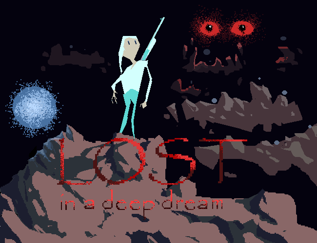
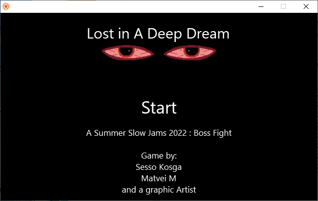
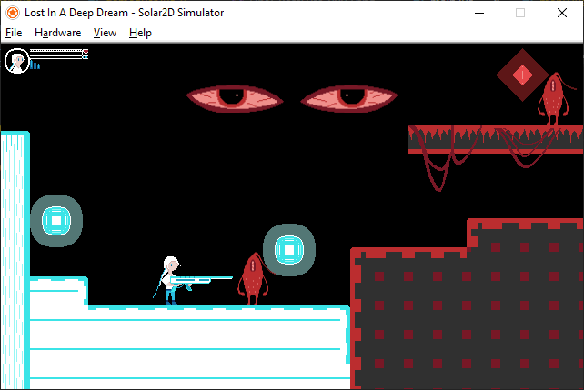
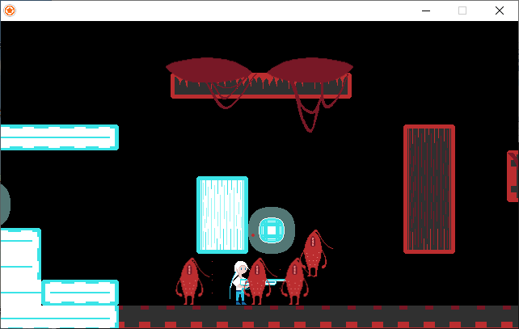
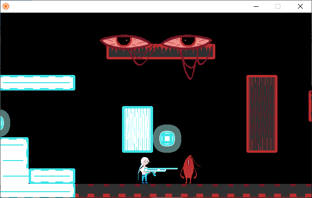
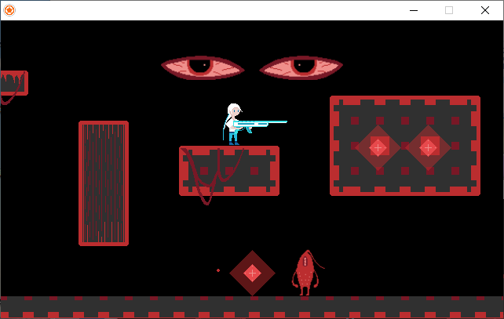
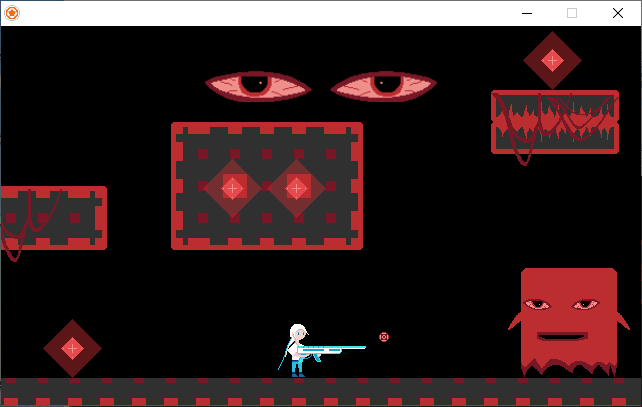
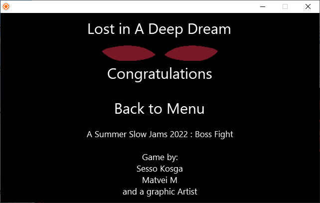

# Lost In A Deep Dream

A 2d Shooter

Made for Summer [Slow Jams 2022: Boss Fight](https://itch.io/jam/ssjbossfight)

## Creative theme : Dreams and Nightmares!

#### Language : Lua

#### Engine : Solar 2d

#### [Get on itch.io](https://senor16.itch.io/lost-in-a-deep-dream)

#### Controls :

- Arrow keys or WASD to move
- Space to shoot
- Mouse to click on buttons

#### Code : Sesso Kosga (senor16)

#### Sound and Cover:  Moot Voot

#### Graphics: An anonymous artist 

#### Development duration : 21h 15min

#### Post mortem:

**Solar 2d** is great for making mobile games.

If everybody says it, it may be true. But what about making a desktop game ? Is it still so great ? 

This is the question I wanted to answer when working on this jam with that tool. Personally I didn't appreciate working with it for one reason: **game loop**.  I'm so used to work with game loops, in fact, in all the games I made, all the tools (Löve, Monogame, Tic-80, Pico-8, Haxe-Flixel, C/SDL, JS vanilla) I used  had a game loop, may it be in a way or another. They all had a function to load, update and draw stuffs to the screen or they simply put everything in the same function. So while working with Solar 2d, I wanted to do the same, but no way. I had to completely depend on the physic system to make things move on the screen. Sure I still could use the `enterframe` event  to recreate the game loop the way I wanted it, but that will be working against the tool, and if it I had to do that, I'll prefer using another tool.

That way of doing remembers me of the mobile frameworks (Xamarin, Flutter) I used to work with. With these frameworks, there is not game loop, just events that we have to listen to. By working the same way, Solar 2d shows us that it a great tool for mobile games. And the `enterframe` event is like a work around to still use a game loop. 

Of what I've experienced, the first contact with Solar 2d can be very disturbing when we come from a tool that uses a game loop, the transition may be a little painful. But when we get used to it, we can get the job done.

So, is Solar 2d great for making desktop games ?

The answer is a big  **yes.** 

#### Screenshots:

  
